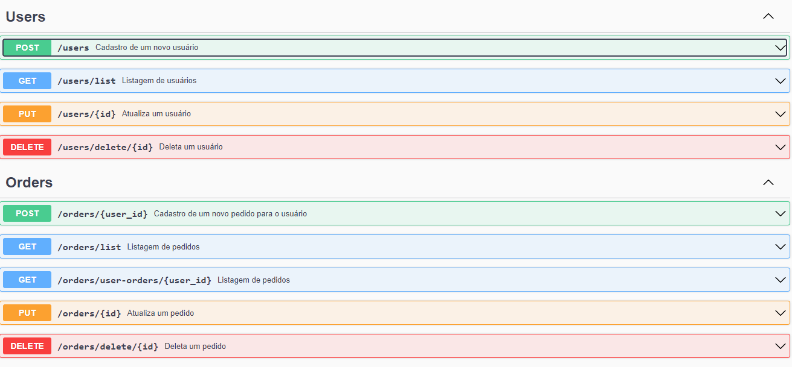

<h1 align="center"><strong>Orders by Users API</strong></h1>

## **Sobre**
API de cadastro de usuários e pedidos.

---

## ☑️ **Features**

#### **Users**
* ✅ Deve ser capaz de criar um novo usuário
* ✅ Deve ser capaz de listar os usuários
* ✅ Deve ser capaz de atualizar o telefone de um usuário
* ✅ Deve ser capaz de deletar um usuário

#### **Orders**
* ✅ Deve ser capaz de criar uma nova order
* ✅ Deve ser capaz de listar todas as orders
* ✅ Deve ser capaz de listar todas as orders do usuário
* ✅ Deve ser capaz de atualizar a order
* ✅ Deve ser capaz de deletar uma order

[Business Case](./BusinessCase.MD)

---

## 🛠️ **Pre-requisitos**

Antes de começar, você precisará garantir que tenhas as seguintes ferramentas instaladas em sua máquina: [Git](https://git-scm.com), [NodeJS](https://nodejs.org/en/), [Docker](https://www.docker.com/), [Docker Compose](https://docs.docker.com/compose/install/) e [Yarn](https://yarnpkg.com/) (opcional).

---

## 🗂️ **Baixando o projeto**

<br>

```bash
# Clone este reposotório com o comando
$ git clone https://github.com/rafaelsgomes/leoo-back-end-challenge

# Acesse o diretório do projeto
$ cd leoo-back-end-challenge

# Instale as dependências com o comando
$ yarn

# Crie os containers da aplicação com o comando
$ docker-compose up -d

# lembre-se de alterar os arquivos ormconfig e docker-compose.yml com os dados de acesso

# O servidor ficará disponível na porta:3333 acesse: http://localhost:3333
```

---

## 💻 **Utilizando a API**

Ao acessar a rota `http://localhost:3333/api-docs` será redirecionado para a página da documentação criada pelo swagger-ui-express, onde será possível realizar os testes da aplicação.

<h3 align="center" >
    
</h3>

---

## 🚀 **Tecnologias**

<table>
    <tr>
        <td align="center"><a  href="https://nodejs.org/en/">NodeJS</a></td>
        <td align="center"><a href="https://expressjs.com/pt-br/starter/installing.html">Express</a></td>
        <td align="center"><a href="https://www.typescriptlang.org/">TypeScript</a></td>
        <td align="center"><a href="https://typeorm.io/#/">TypeOrm</a></td>
        <td align="center"><a href="https://github.com/microsoft/tsyringe">Tsyringe</a></td>
        <td align="center"><a href="https://www.postgresql.org/">PostgreSQL</a></td>
        <td align="center"><a href="https://www.npmjs.com/package/uuid">UUID</a></td>
        <td align="center"><a href="https://www.npmjs.com/package/swagger-ui-express">Swagger-UI-Express</a></td>
    </tr>
    <tr>
        <td align="center">v14.x*</td>
        <td align="center">4.17.2</td>
        <td align="center">4.5.5</td>
        <td align="center">0.2.41</td>
        <td align="center">4.6.0</td>
        <td align="center">8.7.1</td>
        <td align="center">8.3.2</td>
        <td align="center">4.3.0</td>
    </tr>
</table>

---
> <p>Made with ❤️ by Rafael Gomes <a href="https://www.linkedin.com/in/rafaelsgomes/">See my LinkedIn</a></p>
